# ARES – Autonomiczny Robot Elektroniczny Sumo

Projekt autonomicznego robota minisumo, budowanego w ramach zajęć z przedmiotu Sterowniki Robotów. Robot przeznaczony jest do rywalizacji na arenie zgodnej z regulaminem Robotic Arena.

---

## Spis treści
- [Opis projektu](#opis-projektu)
- [Architektura systemu](#architektura-systemu)
- [Konfiguracja mikrokontrolera](#konfiguracja-mikrokontrolera)
- [Urządzenia zewnętrzne](#urządzenia-zewnętrzne)
- [Projekt elektroniki](#projekt-elektroniki)
- [Konstrukcja mechaniczna](#konstrukcja-mechaniczna)
- [Oprogramowanie](#oprogramowanie)

---

## Opis projektu

Głównym celem projektu jest zbudowanie w pełni autonomicznego robota mobilnego klasy **MiniSumo**, którego podstawowym zadaniem jest wykrycie przeciwnika na arenie, szybkie dotarcie do niego i wypchnięcie poza białą linię ograniczającą ring. Robot jednocześnie musi samodzielnie unikać wyjechania poza obszar walki.

Robot wykorzystuje system czujników:
- **Czujniki białej linii** – do detekcji krawędzi areny
- **Czujniki odległości IR (ToF)** – do lokalizacji przeciwnika
- **System ASS (Anti-Sumo System)** – serwomechanizmy z białymi ekranami, wprowadzające przeciwnika w błąd

---

## Architektura systemu

System składa się z trzech głównych warstw:

1. **Warstwa sprzętowa** – mikrokontroler, czujniki, silniki, sterowniki, zasilanie
2. **Warstwa sterowania** – oprogramowanie na Raspberry Pi Pico
3. **Warstwa komunikacji** – USART (Bluetooth) do debugowania i monitorowania

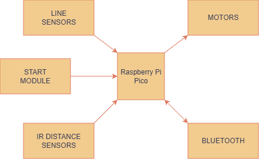

---

## Konfiguracja mikrokontrolera

W projekcie wykorzystano **Raspberry Pi Pico 2 WH** z układem RP2350 (ARM Cortex M33), który oferuje:
- Dwa rdzenie obliczeniowe
- Wbudowany moduł WiFi/Bluetooth (CYW43439)
- Wystarczającą liczbę pinów GPIO
- Niskie zużycie energii

### Konfiguracja pinówdotarcie

| Pin | Tryb pracy        | Funkcja                                     |
|-----|-------------------|---------------------------------------------|
| 1   | USART0 TX         | Wysyłanie danych Bluetooth                  |
| 2   | USART0 RX         | Odbieranie danych Bluetooth                 |
| 10  | GPIO_Output       | Silnik lewy – kierunek "do przodu"          |
| 11  | GPIO_Output       | Silnik lewy – kierunek "do tyłu"            |
| 12  | PWM               | Silnik lewy – sygnał PWM                    |
| 14  | PWM               | Silnik prawy – sygnał PWM                   |
| 15  | GPIO_Output       | Silnik prawy – kierunek "do tyłu"           |
| 16  | GPIO_Output       | Silnik prawy – kierunek "do przodu"         |
| 19  | GPIO_Input        | Start walki (przycisk/modul startowy)       |
| 20  | GPIO_Input        | Kill (koniec walki)                         |
| 21  | GPIO_Output       | XSHUT 1 – włącznik czujnika odległości 1    |
| 22  | GPIO_Output       | XSHUT 2 – włącznik czujnika odległości 2    |
| 24  | GPIO_Output       | XSHUT 3 – włącznik czujnika odległości 3    |
| 25  | GPIO_Output       | XSHUT 4 – włącznik czujnika odległości 4    |
| 26  | I2C0 SDA          | Dane z czujników odległości IR              |
| 27  | I2C0 SCL          | Zegar czujników odległości IR               |
| 31  | ADC_IN            | Prawy czujnik linii (analogowy)             |
| 32  | ADC_IN            | Lewy czujnik linii (analogowy)              |

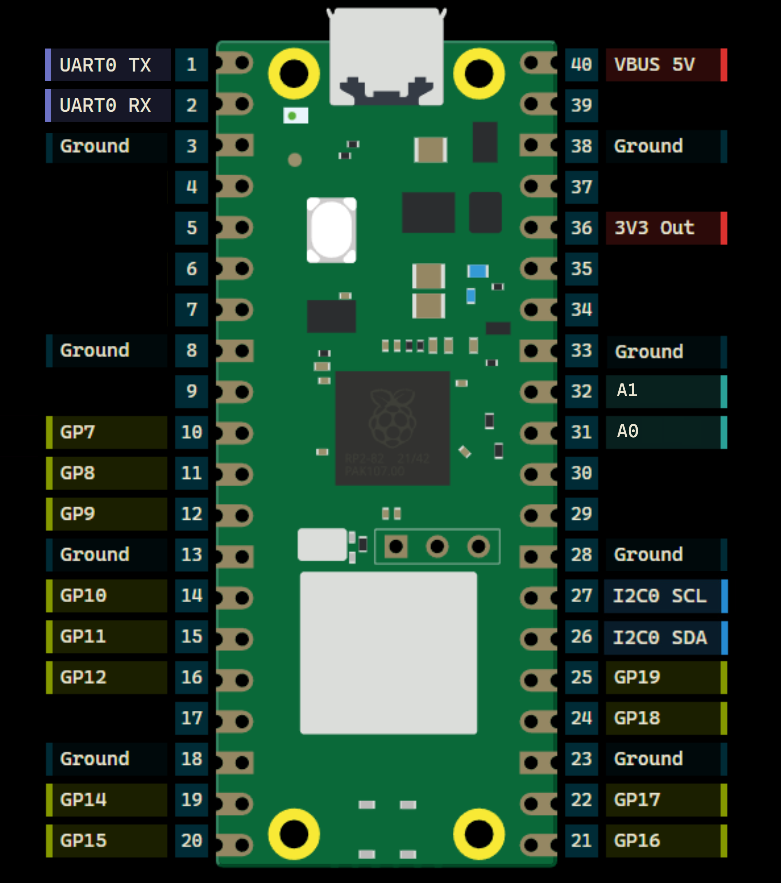

### Konfiguracja peryferiów

#### USART (Bluetooth)
- Baud Rate: 115200
- Word Length: 8 bitów
- Parity: Brak
- Stop Bits: 1

#### I2C (czujniki VL53L0X)
- Tryb: Standard Mode
- Częstotliwość: 100 kHz
- Adresowanie: 7-bitowe

#### ADC (czujniki linii)
- Rozdzielczość: 12 bitów
- Tryb: Single Conversion
- Częstotliwość próbkowania: 96 cykli

---

## Urządzenia zewnętrzne

### 3.1 Czujniki białej linii – KTIRO711S
- **Zasilanie:** 5V
- **Wyjście:** analogowe
- **Rodzaj:** odbiciowy fototranzystorowy
- **Rozdzielczość:** 1 mm
- **Zastosowanie:** detekcja białej linii areny

### 3.2 Czujniki odległości IR – VL53L0X
- **Zasilanie:** 3.3 – 5V
- **Zakres pomiarowy:** 2 – 200 cm
- **Częstotliwość odczytu:** do 50 Hz
- **Interfejs:** I2C
- **Kąt widzenia:** 25° stożkowy
- **Ilość:** 4 szt. (2 przednie, 2 skośne)

### 3.3 Sterownik silników – TB6612FNG
- **Napięcie silników:** do 15V
- **Napięcie logiczne:** 2.7 – 5.5V
- **Prąd ciągły:** 1.2A na kanał
- **Prąd szczytowy:** 3.2A
- **Tryby:** CW, CCW, hamulec, stop

### 3.4 Silniki DC – N20-BT37 210:1 140RPM
- **Napięcie:** 3 – 9V
- **Przekładnia:** 210:1
- **Prędkość:** 140 RPM
- **Moment obrotowy:** 3.6 kg·cm

### 3.5 Serwomechanizmy – MG90S Mikro (ASS)
- **Napięcie:** 4.8V
- **Kąt obrotu:** 180°
- **Moment:** 2 kg·cm
- **Zastosowanie:** system wprowadzania w błąd przeciwnika

### 3.6 Moduł startowy MiniSumo
- **Funkcja:** detekcja startu walki
- **Zapobiega falstartom**
- **Wymagany na zawodach**

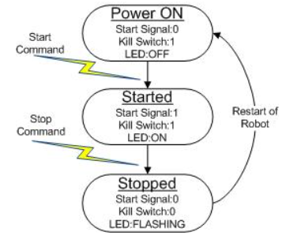

---

## Projekt elektroniki

Zaprojektowano dedykowaną płytkę PCB w formie shielda dla Raspberry Pi Pico, która integruje wszystkie komponenty:

### Główne cechy projektu:
- Zasilanie z baterii LiPo 7.4V
- Stabilizator napięcia 5V dla logiki i czujników
- Filtracja napięć i zabezpieczenia przeciwprzepięciowe
- Wyprowadzenia dla wszystkich czujników i silników
- Łatwy montaż na robocie

### Schematy i projekty:

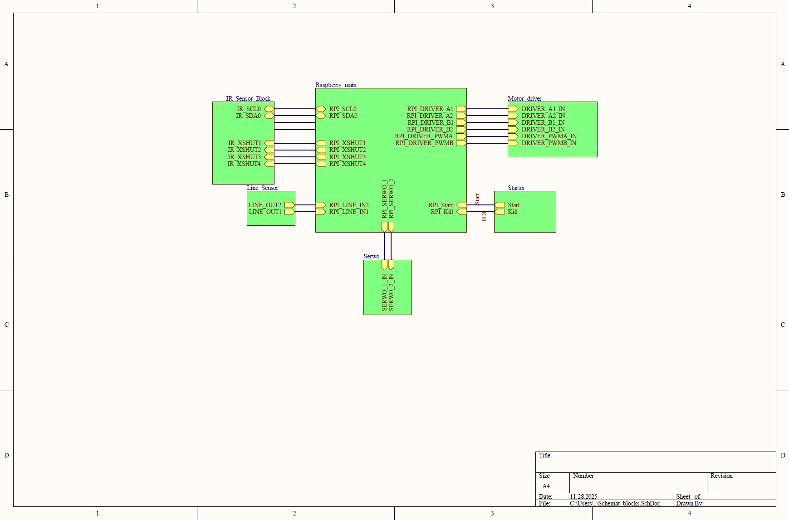

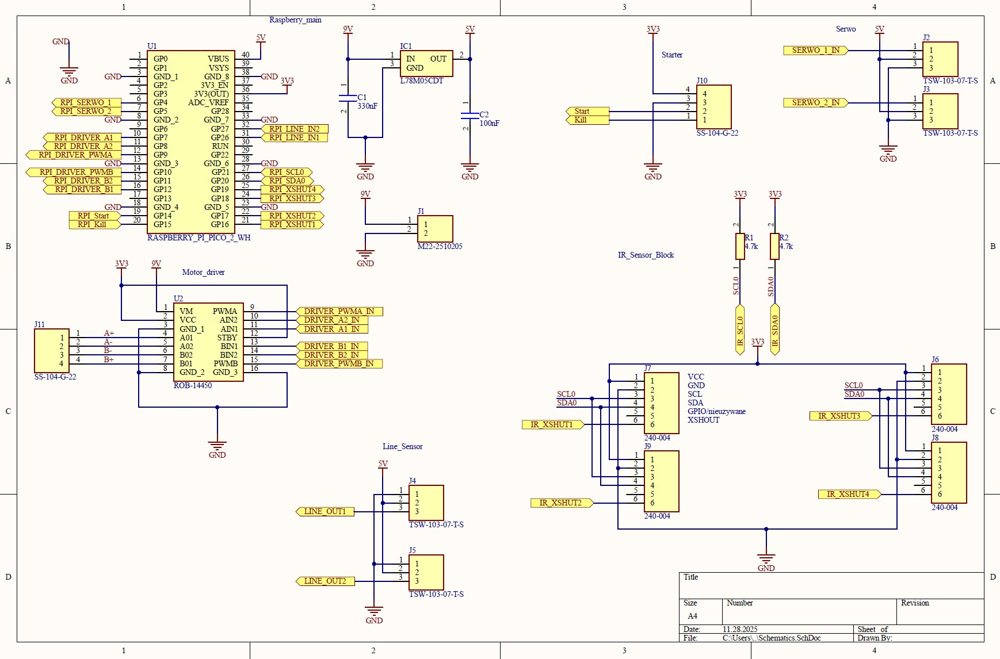

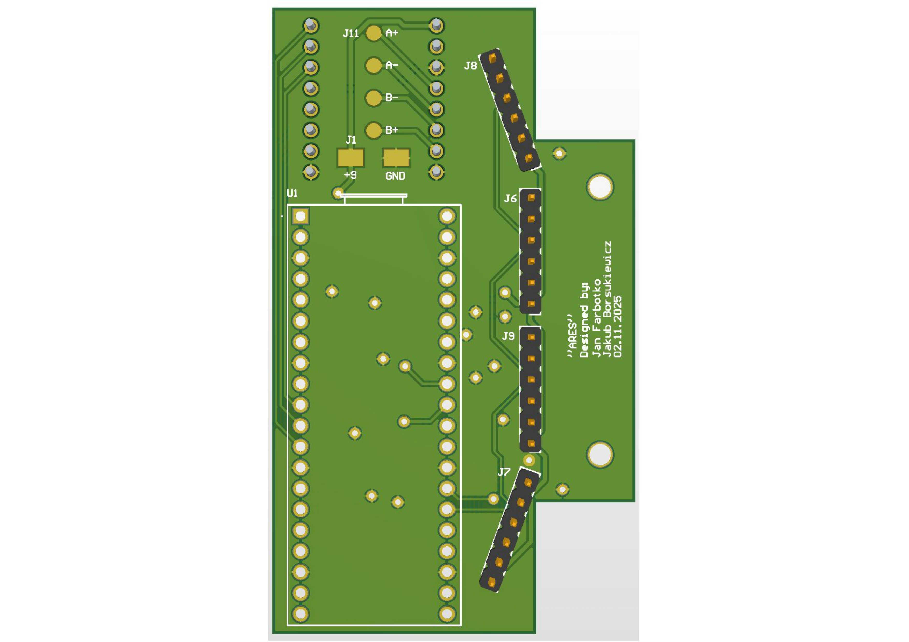

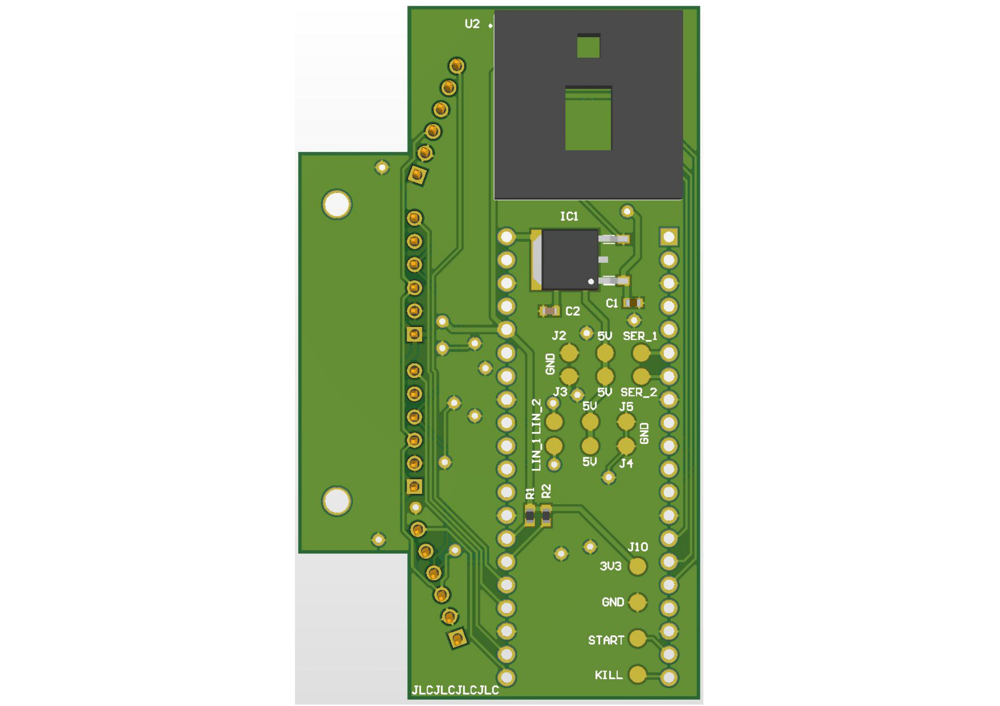

### Montaż i lutowanie:

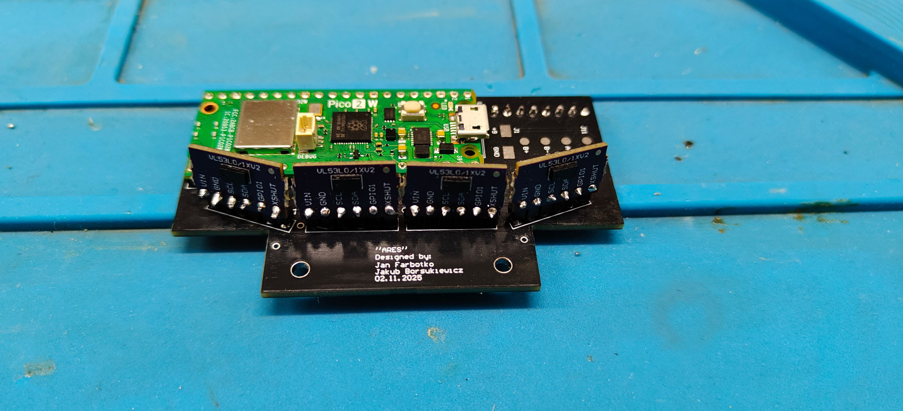

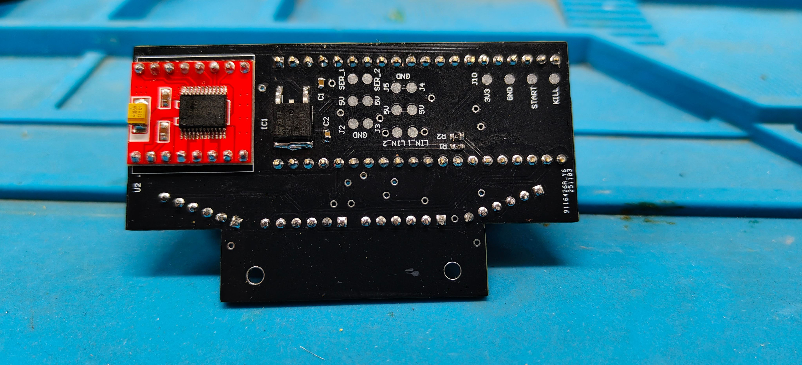

---

## Konstrukcja mechaniczna

### Projekt CAD
Konstrukcja zaprojektowana w **Autodesk Inventor**, składa się z:
- Głównej obudowy (korpus)
- Pokrywy górnej
- Dwóch części plugów
- Kół z felgami 3D i oponami silikonowymi

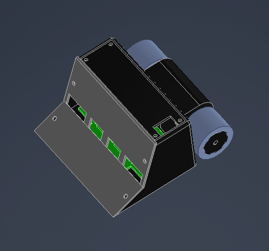

### Produkcja
- Wydruk 3D z filamentu PET-G
- Wstawki mosiężne do mocowania
- Śruby metalowe M3 oraz M2.5
- Opony z silikonu formierskiego

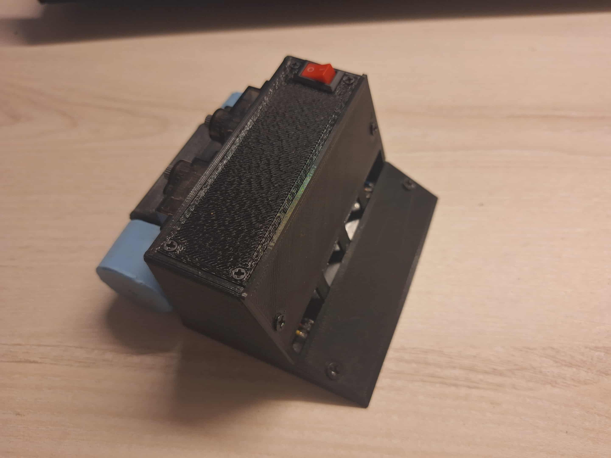

---

## Oprogramowanie

Głównym zadaniem działania programu dla robota minisumo jest realizacja autonomicznego cyklu walki. Robot ma za zadanie odpowiednio przetwarzać otrzymywane dane z czujników odległości i linii, na które odpowiednio reaguje poprzez jazdę w zadanym kierunku. 

### Logika programu
Logika programu została podzielona na odpowiednie stany:
- Start - po uruchomieniu robota, następuje inicjalizacja wszystkich czujników i urządzeń; czujniki zbierające dane zaczynają swoją pracę.
- Walka - następuje po odpowiednim zadaniu sygnału przez moduł startowy; robot przetwarza otrzymane dane z czujników i zadaje odpowiednie sterowanie do silników w zależności od podjętej strategii.
- Koniec - po zadaniu odpowiedniego sygnału przez moduł startowy praca robota jest zatrzymywana.

Diagram blokowy na rysunku:
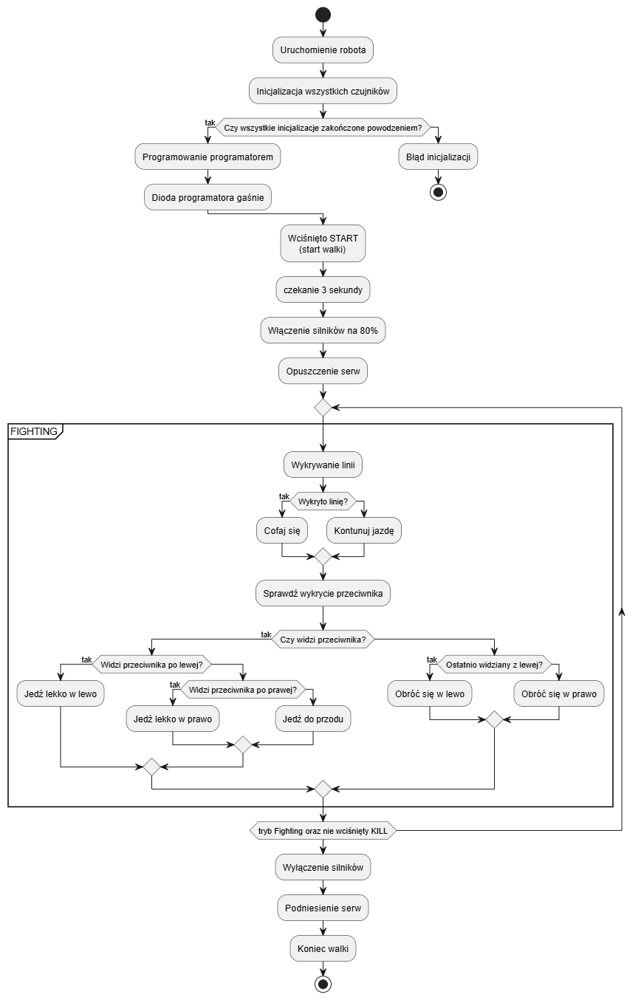

### Bluetooth
Funkcja Bluetooth nie jest elementem wymaganym, aby program robota minisumo działał. Mimo to jest to aspekt, który ułatwia pracę. Bluetooth działa w dwie strony. Z jednej pozwala na łatwy odczyt danych z czujników, co eliminuje potrzebę podłączenia robota do urządzenia z terminalem np.komputera. Z drugiej strony dzięki urządzeniu posiadającemu zwykłą aplikacje do obsługi terminala z bluetooth np.telefon jesteśmy również w stanie zadać robotowi odpowiednie komunikaty, które on obsługuje np. jazda do przodu z określoną prędkością. 

### Czujniki odległości
Czujników odległości to jedne z najważniejszych aspektów pracy całego oprogramowania robota minisumo. To właśnie te czujniki decydują, w którą stronę powinien poruszyć się robot w danym czasie. W implementacji użyto 4 czujników, które działają na jednej magistrali I2C. Aby można było odczytywać informacje z każdego z nich osobno należy odpowiednio nadać adresy dla każdego z czujników. Wszystkie czujniki są wyłączane poprzez ich piny XSHUT, następnie każdy z nich jest pojedynczo włączany i zostaje mu zmieniony adres. Każdy z nich jest ustawiany, aby działać odpowiednio jak założył producent (w tym celu posłużono się gotowymi funkcjami kalibrującymi czujniki). 

### Czujniki linii
Czujniki linii to ważny element oprogramowania robota minisumo. To one odpowiadają za to, że robot samoistnie nie wyjedzie za obszar ringu. Ich implementacja nie należy do najtrudniejszej - czujniki wykrywają czy odczytana wartość z przetwornika ADC zmieniła się po najechaniu robota na obszar białej linii i nie wyniosła wartości poniżej zadanej. W przypadku wykrycia zostaje wykonana odpowiednia akcja.

### Silniki
Program silników odpowiada za aspekt poruszania się robota w założonym kierunku z odpowiednią prędkością. Jest to element, który wykonuje polecenia zadane przez logikę i przyjętą strategię po przetworzeniu danych z czujników. Prędkość obrotu silników jest sterowana za pomocą PWM. Dzięki odpowiednim funkcją można odpowiednio przeskalować wartości tak, aby zadawać wypełnienie liczbami z przedziału [0-100\%]. 

W robocie znajdują się dwa silniki, gdzie każdy jest sterowany osobnym sygnałem PWM oraz każdy z nich ma również po dwa wejścia logiczne (dir1 i dir2). To właśnie od tych pinów zależy w którą stronę będzię obracać się silniki. Zadanie na jeden z nich stanu wysokiego a na drugi niskiego spowoduje obracanie się silnika w odpowiednią stronę. Gdy oba piny otrzymają stan niski, to silniki się zatrzymają - stop (Luz). W przypadku gdy oba stany będą wysokie - hamulec. 

### Serwa
Ten aspekt został opracowany dodatkowo, ale jest jednym z założeń strategicznych robota minisumo. Na robocie zamontowano dwa serwa, a na ich końcach cienkie "skrzydła". Po wystartowaniu walki serwa są opuszczane co powoduje, że robotowi przybywa na wielkości - przeciwnik wykrywa przeszkodę, która nie jest sam robot co może dać przewagę. Serwa tak jak silniki są sterowane przez PWM. Jednak różnica jest taka, tutaj zadajemy pozycję (kąt) w jakim ma ustawić się sprzęt. Zależy to oczywiście od wypełnienia - proporcji czasu trwania impulsu wysokiego do całego czasu okresu trwania sygnału. Aby uprościć to odpowiednio przeliczono te wartości na stopnie. Z dokumentacji wyczytano, że częstotliwość pracy serwa wynosi 50Hz, a to pozwoliło określić jaki czas trwania okresu to jaki kąt pozycji serwa. 

### Starter
Starter to zwykła maszyna stanów. Jest to odbiornik do programatora, który pozwala na sprawiedliwe jednoczesne wystartowanie obu robotów podczas zawodów. Piny logiczne startera po zaprogramowaniu go przyjmują odpowiednio stany: Start - 0, Kill - 1. Następnie gdy programator wystartuje walkę stany zmieniają się odpowiednio na (1,1) - następuje walka. Gdy programator wywoła sygnał stopu - oba stany pinów przyjmą odpowiednio (0,0) - co powoduje zatrzymanie robotów. 

---

**Autorzy:** Jakub BORSUKIEWICZ, Jan FARBOTKO